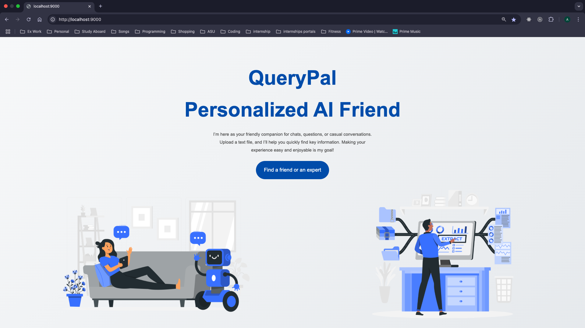
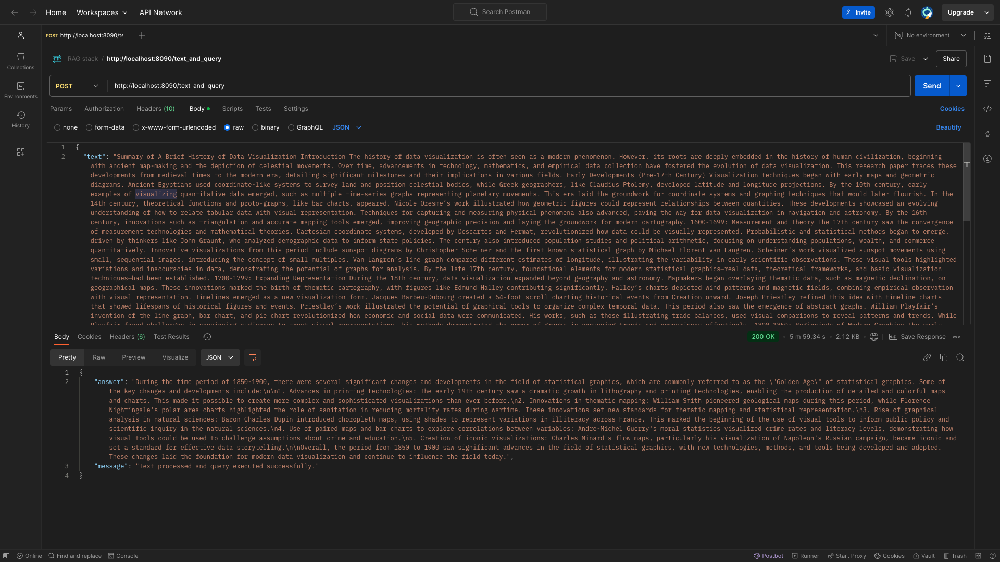

# QueryPal - Your Personalized AI Companion
**Built with LLAMA 2 (via Ollama), ChromaDB, Docker, Flask, React, and Redux**

---

## Overview

QueryPal is a **Retrieval-Augmented Generation (RAG)** system that leverages Meta's Llama 2.0 model (via **Ollama**), ChromaDB for vector storage, and LangChain for process orchestration. This project seamlessly combines document retrieval and query handling, enabling:

- Contextually relevant responses to questions about uploaded documents.
- General knowledge query answering.

A sleek and intuitive dashboard enhances the user experience, making it easy to interact with the system.

---

## Screenshots

### Homepage


### Chat Interface


---

## RAG Architecture

QueryPal integrates robust document retrieval capabilities with LLM-driven response generation to ensure accurate and context-aware answers. The process involves:

- **Retriever**: Encoding and indexing external documents into vectors for similarity-based searches.
- **Generator**: Using **Llama 2.0 (via Ollama)** to generate responses based on retrieved documents or pre-trained knowledge.

LangChain orchestrates the workflow, ensuring a seamless integration of these components.


---

## Features

- **General Queries**: Answers a wide range of questions using Llama 2.0’s built-in knowledge, even without uploaded documents.
- **Document-Based Q&A**: Delivers precise, context-aware answers by analyzing uploaded documents.

---

## How It Works

1. **Embedding Creation**: Generates document embeddings using HuggingFace.
2. **Data Persistence**: Stores embeddings for future use.
3. **Vector Database**: Builds a ChromaDB-based vector database for efficient retrieval.
4. **Retriever Initialization**: Fetches relevant documents for user queries.
5. **General Query Handling**: Leverages Llama 2.0 to answer questions unrelated to uploaded documents.
6. **LLM Integration**: Ensures deterministic, contextually relevant answers using **Llama 2.0 (via Ollama)**.
7. **Q&A Pipeline**: Combines the retriever and generator components via LangChain.

---

## Project Structure

- **Frontend**: Developed with React, featuring Redux for state management and React Router for navigation. The UI is intuitive and user-friendly.
- **Backend**: Built on Flask, hosting the RAG stack and exposing necessary APIs.

---

## Getting Started

### Clone the Repository

```bash
git clone git@github.com:ankitrajput0096/QueryPal-Personalized-AI-Friend.git
cd QueryPal-Personalized-AI-Friend
```

---

## Building the Application

### Using Docker

1. Build the Docker image:
   ```bash
   docker-compose build
   ```
2. Start the Docker containers:
   ```bash
   docker-compose up
   ```

### Running the Pre-Built Docker Image

1. Start the containers with:
   ```bash
   docker-compose -f docker-compose-run.yml up
   ```

---

## Interacting with the Backend APIs

### Postman API Collection

A [Postman collection](./RAG_backend/RAG_stack.postman_collection.json) is included for easy API interaction. Import the collection and use the following endpoints:

1. **General Query**
   - **Description**: Handles questions unrelated to uploaded documents.
   - **Endpoint**: `http://127.0.0.1:8090/ask_general_query`
   - **Method**: POST
   - **Request Body**:
     ```json
     {
       "query": "What is the capital of USA?"
     }
     ```
   

2. **Upload Document**
   - **Description**: Uploads documents for embedding and storage.
   - **Endpoint**: `http://127.0.0.1:8090/upload_document`
   - **Method**: POST
   - **Request Body**: Form-data with key `file`.
   

3. **Similarity Search**
   - **Description**: Finds content similar to a query in uploaded documents.
   - **Endpoint**: `http://127.0.0.1:8090/similarity_search`
   - **Method**: POST
   - **Request Body**:
     ```json
     {
       "query": "Find content similar to this query."
     }
     ```
   

4. **Query Document**
   - **Description**: Queries uploaded documents for specific information.
   - **Endpoint**: `http://127.0.0.1:8090/query_document`
   - **Method**: POST
   - **Request Body**:
     ```json
     {
       "query": "What is the content of the document?"
     }
     ```
   

5. **Upload and Query Text**
   - **Description**: Uploads text and queries it simultaneously.
   - **Endpoint**: `http://127.0.0.1:8090/text_and_query`
   - **Method**: POST
   - **Request Body**:
     ```json
     {
       "text": "Summary of A Brief History of Data Visualization...",
       "query": "What were the changes during the 1850–1900 Golden Age of statistical graphics?"
     }
     ```
   

---

This README ensures a clear understanding of QueryPal’s features and usage. Feel free to reach out with questions or suggestions!

